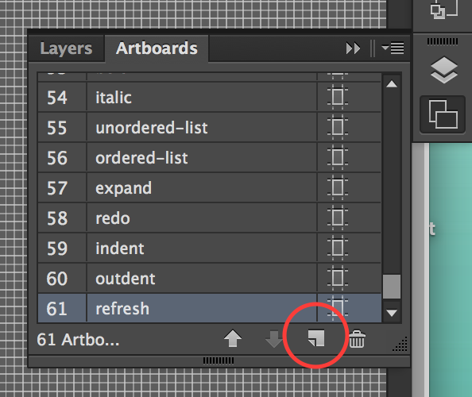
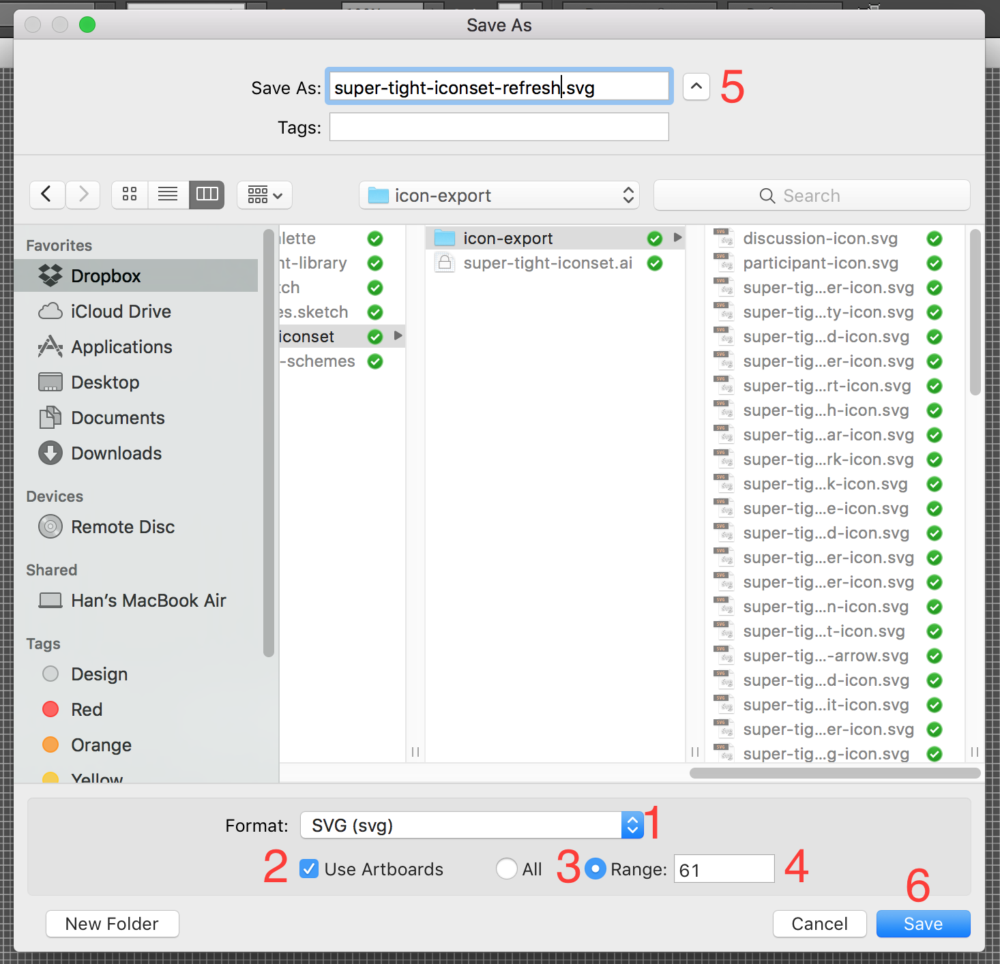
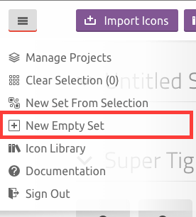
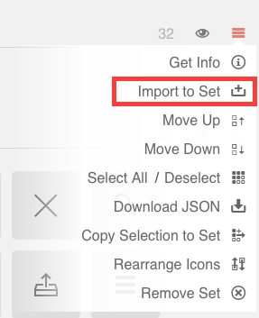

# How to properly update Super Tight Iconset

This guide is to help you on adding new icons and export the correct icon font for ACL.

First of all, a few quick informations that you need to know before starting.

### Designing Icons

We use Adobe Illustrator (AI) to design and export our icons as it yields consistent results so far. But keep in mind this might change later on. The AI file is locating here

```
Dropbox/anduin/Mockups/Resources/super-tight-iconset/super-tight-iconset.ai
```

When designing an icon, create new artboard in AI and give it meaningful name; maybe your icon's name. For the sake of being organized, create this new artboard from the very last artboard in the file.



You can draw your icon in path or shape, doesn't matter. But in the end you must convert to outline. To do that, select your icon, then go to `Object > Path > Outline Stroke`.

Once that's all done, we are ready to export to SVG.

### Exporting to SVG

To export, click on `File > Save As...`. A dialog will appear, then choose path to export your icon. We have a folder to export on Dropbox, use that folder.

```
Dropbox/anduin/Mockups/Resources/super-tight-iconset/icon-export
```

In the **Format**, choose **SVG (svg)***. Check the **Use Artboards** checkbox. Choose **Range** then input the artboard number of the icon you're about to export. Also, please export one icon at a time for better control and more correct export. The last thing is to change your file's name. Then click **Save**.



Exporting is done, let's move on!

### Icomoon Import and Generate Icon Font

We're currently using [Icomoon App](https://icomoon.io/app/) to generate our icon font. When you have Icomoon App open click on the hamburger Menu button at the top left corner, choose **New Empty Set**. This is to ensure that what you're updating and importing is correct and prevent duplications. We'll get to that in a second.



Now you'll have an **Untitled Set**, click on the hamburger menu on the right and choose **Import to Set**



A dialog will open. Now, your job is to locate the JSON file in ACL source code. It could be found here

```
../fonts/super-tight-iconset.json
```

Click **Open**, a dialog from Icomoon will appear to ask if you would like to load all the settings, too. Click **Yes**. Duh.

Now the existing Super Tight Iconset is there, your job is to add a new icon. Choose your new font by clicking **Import to Set** like above. Make sure to add your new icon at the very end of the list so that when you generate the icon font, it will not mess up the Unicode character of the font.

When ready to generate font. Select all the icon. Then click on **Generate Font** at the bottom. Review your glyphs. Go to the newly added icons, and give it a proper name.

Once that's done, click **Download** at the bottom bar.

### Import into ACL

Icomoon will give you a zip folder. In this, locate the `/fonts` folder, copy all the files to ACL's `../fonts/`. Then back to the zip folder, look for `selection.json`, rename it to `super-tight-iconset.json` and also copy to ACl's font folder.

That's it, you're done, now update the SCSS file :)
